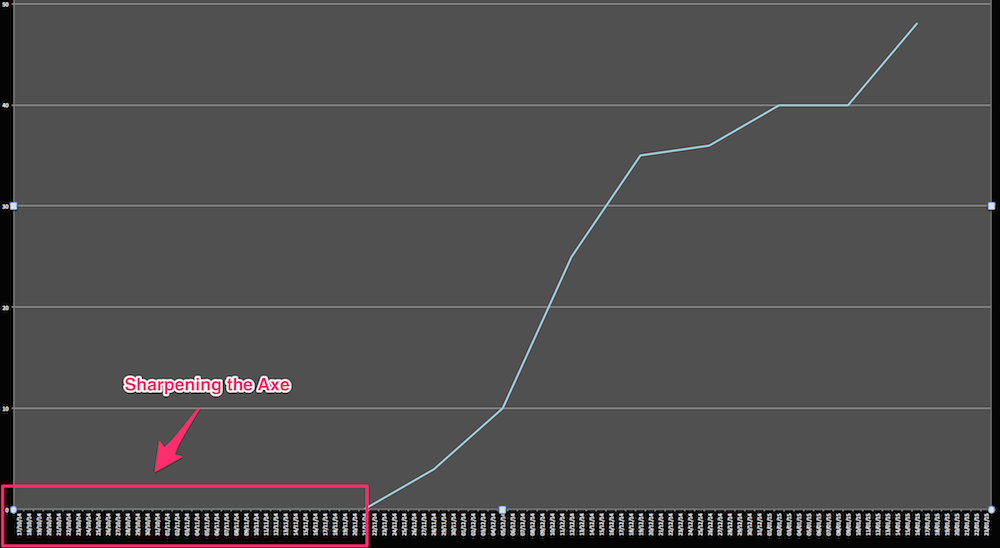
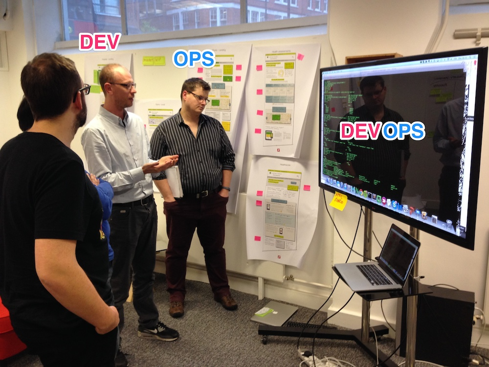

# Sharpening the Axe
##*Building the Dev/Ops relationship on a Fixed Date, Fixed Scope project.*

###Talk Proposal

The story of how we built an automated provisioning and deployment pipeline using Ansible targeting Vagrant, AWS and On Prem Virtual Tin to deliver fixed scope to a fixed date for a marketing lead Christmas launch.  

For an encore re-used it all to take advantage of repeat business that came in off the back of the project’s success.

It’s the story of this ‘S’ Curve:



It’s the story Dev/Ops as a relationship with shared ownership of the lower tiers of the stack:


It’s about not using existing tools just because they are there, creating simple solutions to complex problems, separating concerns and a healthy amount of shell scripting foo.

It’s about the ROI we got when we used the pipeline and infrastructure built for this project to deliver two more projects which only came into existence as a result of the success of this one.

It’s also about a Christmas holiday’s production defect which should not have escaped into the wild and how we fixed it in short order.

We will share our Ansible playbooks, diagrams, screenshots, data and experience, using the project artefacts presented as a ‘Mega Poster’ to guide a non-linear, audience lead conversation.

	There will be a live demo.

